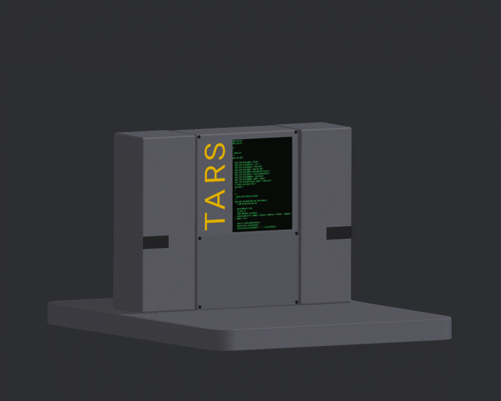

# TARS WIZARD

This project is for people who want to make TARS, a robot from movie Interstellar.

## Installation

Use the downloads page on the website for all downloadable content and guides and parts list.

## Data Collection

This project collects users' email addresses. You will be asked to Login or Create an account to be able to access downloadable FREE content and or use Forums page to discuss issues or showcase your own project. Emails collected will be used to notify loyal users about potential updates to the code or 3D files.

## Contributing

Pull requests are welcome. For major changes, please open an issue first
to discuss what you would like to change.

Please make sure to update tests as appropriate.

## License

- Repository: No license. All rights are reserved. Users are not allowed to copy, modify, distribute, or even use the project without explicit permission.
 
- Website: Users can download the content on the website and modify it but are not allowed to alter or download the files or content from this repository.